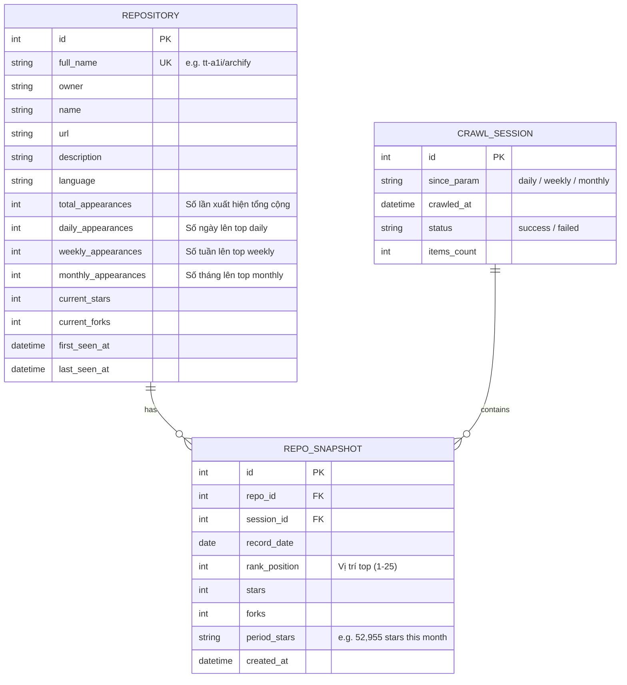

# Kế Hoạch Xây Dựng Hệ Thống Cào Dữ Liệu GitHub Trending & Thống Kê Dạng Bảng

Hệ thống tự động cào dữ liệu từ [GitHub Trending](https://github.com/trending) (hỗ trợ các mốc `daily`, `weekly`, `monthly`), lưu trữ vào cơ sở dữ liệu quan hệ, tự động tính toán lũy kế **số lần xuất hiện (occurrence count)** của từng repository qua các ngày cào, và cung cấp giao diện bảng thống kê trực quan, dễ lọc và sắp xếp.

---

## 1. User Review Required (Các quyết định kỹ thuật cần xác nhận)

> [!IMPORTANT]
> **Quy tắc tính "Số lần xuất hiện" (Occurrence Counter Logic):**
> 1. **Cách tính theo Ngày Lịch (Calendar Day - Khuyến nghị):** Mỗi ngày cào (ví dụ 19/09/2026), nếu repo xuất hiện trong danh sách daily trending thì chỉ tính +1 lần cho ngày đó. Nếu bạn ấn cào lại nhiều lần trong cùng 1 ngày, hệ thống chỉ cập nhật thông số sao/fork mới nhất chứ không cộng dồn số lần xuất hiện sai lệch.
> 2. **Cách tính theo Phiên cào (Per Crawl Batch):** Mỗi lần bấm nút hoặc kích hoạt cào dữ liệu, bất kể cùng ngày hay khác ngày, nếu repo có trong kết quả thì sẽ tăng `+1`.
> 
> *Đề xuất:* Áp dụng **Cách 1** (theo ngày) để đảm bảo số liệu phản ánh đúng: "Repository này đã trending trong bao nhiêu ngày khác nhau".

> [!NOTE]
> **Lựa chọn Tech Stack phù hợp & tối ưu:**
> - **Backend & Crawler:** Python (FastAPI + BeautifulSoup4/Selectolax + SQLite/PostgreSQL + APScheduler).
>   - *Lý do:* Python cào dữ liệu rất ổn định, phân tích HTML nhanh, FastAPI cung cấp API chuẩn OpenAPI và hỗ trợ background tasks nhẹ nhàng.
> - **Cơ sở dữ liệu:** SQLite (hoặc PostgreSQL). Ban đầu SQLite là lựa chọn hoàn hảo: gọn nhẹ, file-based, không cần cài đặt server cồng kềnh, dễ sao lưu.
> - **Frontend:** React + Tailwind CSS (hoặc Vue / Svelte) với bảng dữ liệu hiện đại (hỗ trợ search, filter ngôn ngữ/thời gian, sort theo số lần xuất hiện, pagination).

---

## 2. Mô Hình Dữ Liệu (Database Schema)



---

## 3. Phân Chia Các Giai Đoạn Thực Hiện (Phased Roadmap)

### Giai Đoạn 1: Phân Tích Cấu Trúc & Thiết Kế Database (Architecture & Setup)
- **Mục tiêu:** Chuẩn bị môi trường, khảo sát trang GitHub Trending và thiết kế CSDL.
- **Nội dung công việc:**
  1. Khảo sát cấu trúc DOM của `https://github.com/trending?since=daily|weekly|monthly` (các selector thẻ `<article class="Box-row">`, tên repo, stars, forks, ngôn ngữ, stars gained).
  2. Thiết kế schema SQLite với SQLAlchemy:
     - Bảng `repositories`: Lưu thông tin chung và bộ đếm `total_appearances`, `daily_appearances`, `weekly_appearances`, `monthly_appearances`.
     - Bảng `crawl_sessions`: Lưu lịch sử mỗi lần chạy cào.
     - Bảng `repo_snapshots`: Lưu lịch sử từng lần xuất hiện (rank, stars thời điểm đó) để vẽ biểu đồ tăng trưởng về sau.
  3. Xây dựng logic Upsert (Idempotency):
     - Kiểm tra nếu `full_name` đã tồn tại trong ngày: cập nhật thông tin mới nhất.
     - Nếu xuất hiện trong một ngày mới: tăng `appearances += 1`, cập nhật `last_seen_at`.
     - Nếu chưa từng có: thêm mới với `appearances = 1`, `first_seen_at = now`.

### Giai Đoạn 2: Xây Dựng Bộ Cào Dữ Liệu (Crawler Engine)
- **Mục tiêu:** Cào dữ liệu ổn định, bóc tách chính xác và lưu vào DB.
- **Nội dung công việc:**
  1. Viết module `crawler.py`:
     - Sử dụng `httpx` với Headers giả lập trình duyệt hợp lệ (User-Agent, Accept, Accept-Language).
     - Parse HTML bằng `BeautifulSoup` (trích xuất đầy đủ: Repo Name, Link, Description, Language, Stars, Forks, Stars gained in period).
  2. Hỗ trợ đầy đủ 3 chế độ: `daily`, `weekly`, `monthly`.
  3. Xử lý ngoại lệ: Retry với Exponential Backoff khi gặp lỗi mạng hoặc HTTP 429/503.
  4. Tạo CLI runner: Cho phép chạy thử nghiệm bằng terminal: `python -m app.crawler --since daily`.

### Giai Đoạn 3: Xây Dựng Backend Service & Quản Lý Lịch Trình (API & Scheduling)
- **Mục tiêu:** Cung cấp RESTful API và lập lịch cào tự động định kỳ.
- **Nội dung công việc:**
  1. Xây dựng các API Endpoint bằng FastAPI:
     - `GET /api/repositories`: Lấy danh sách repo có phân trang, tìm kiếm theo từ khóa, lọc theo ngôn ngữ, lọc theo timeframe, và **sắp xếp theo số lần xuất hiện giảm dần**.
     - `GET /api/repositories/{id}/history`: Lấy lịch sử biến động thứ hạng và star của một repo qua các ngày.
     - `POST /api/crawl/trigger`: Kích hoạt cào dữ liệu thủ công ngay lập tức từ giao diện.
     - `GET /api/crawl/logs`: Xem lịch sử các lần cào (thời gian, trạng thái, số repo cào được).
     - `GET /api/stats/summary`: Thống kê tổng số repo đang theo dõi, top repo trending bền bỉ nhất, phân bổ theo ngôn ngữ.
  2. Tích hợp lập lịch tự động (Background Scheduler):
     - Sử dụng `APScheduler` cấu hình lịch chạy tự động mỗi ngày vào khung giờ cố định (ví dụ 00:05 UTC hoặc 07:00 sáng).

### Giai Đoạn 4: Xây Dựng Giao Diện Bảng Thống Kê (Tabular Dashboard UI)
- **Mục tiêu:** Giao diện web trực quan, tập trung vào bảng dữ liệu chi tiết, thao tác nhanh.
- **Nội dung công việc:**
  1. **Bảng Danh Sách Repository (Trọng tâm):**
     - Cột hiển thị:
       - **# (Rank)**
       - **Repository**: Owner / Name (link trực tiếp GitHub) + Description ngắn gọn.
       - **Ngôn ngữ**: Hiển thị badge màu chuẩn theo bảng màu GitHub.
       - **Số Lần Xuất Hiện (Occurrences)**: Highlight nổi bật (ví dụ: badge màu cam/xanh `🔥 5 lần`).
       - **Tổng Stars & Forks**: Định dạng số dễ đọc (ví dụ: `66,977`).
       - **Stars Tăng Thêm**: `+520 stars today` hoặc `this month`.
       - **Lần đầu thấy / Lần gần nhất**: Thời gian tương đối hoặc ngày cụ thể.
     - Tính năng bảng:
       - Sắp xếp (Sortable headers): Click tiêu đề cột để sort (mặc định sort theo **Số lần xuất hiện giảm dần**).
       - Ô tìm kiếm tức thì (Live search theo tên repo, tác giả, mô tả).
       - Bộ lọc Tabs: `Daily`, `Weekly`, `Monthly`, `Tất cả`.
       - Bộ lọc Dropdown theo Ngôn ngữ lập trình (Python, TypeScript, Rust, Go,...).
  2. **Thanh Thao Tác (Action Bar):**
     - Nút "Cào Dữ Liệu Ngay" (kèm indicator đang chạy / hoàn tất).
     - Bộ đếm tổng quan: "Đang theo dõi X repos", "Y repo xuất hiện > 1 lần".
  3. **Drawer / Modal Chi Tiết:**
     - Khi bấm vào 1 dòng: hiển thị chi tiết các ngày repo này đã lọt vào trending, biểu đồ tăng trưởng số sao.

### Giai Đoạn 5: Kiểm Thử, Tối Ưu & Đóng Gói (Testing & Deployment)
- **Mục tiêu:** Đảm bảo hệ thống vận hành bền bỉ, dễ cài đặt và chạy trên máy tính.
- **Nội dung công việc:**
  1. Viết kịch bản kiểm thử:
     - Test crawler với file HTML mẫu (`docs/html01.html`) để đảm bảo không bị miss trường nào.
     - Test logic cộng dồn `appearances` khi cào liên tiếp nhiều lần.
  2. Tối ưu hiệu năng: Cache dữ liệu bảng, index database trên cột `full_name` và `total_appearances`.
  3. Đóng gói triển khai:
     - Tạo file `docker-compose.yml` hoặc kịch bản chạy 1 lệnh (`run.sh` / `start.bat`).
     - Viết file `README.md` hướng dẫn cấu hình và sử dụng.

---

## 4. Kế Hoạch Xác Minh (Verification Plan)

### Kiểm Thử Tự Động (Automated Tests)
- Chạy unit test parser HTML dựa trên file mẫu `docs/html01.html`:
  ```bash
  pytest tests/test_parser.py
  ```
- Chạy test kiểm tra logic tăng counter `occurrences`:
  - Lần 1: Cào mock batch 1 -> repo X có count = 1.
  - Lần 2: Cào mock batch 2 (cùng repo X) -> repo X có count = 2.
  - Lần 3: Cào lại trong cùng ngày -> count vẫn giữ nguyên là 2 (idempotent).

### Kiểm Thử Thủ Công (Manual Verification)
- Khởi động backend và frontend:
  - Bấm nút "Cào ngay" trên giao diện.
  - Kiểm tra bảng dữ liệu: các repo được hiển thị đúng định dạng bảng, cột "Số lần xuất hiện" hiển thị chính xác.
  - Thử các tính năng filter (ngôn ngữ, timeframe) và sort theo số lần xuất hiện.
  - Giả lập cào ngày tiếp theo và kiểm tra số lần xuất hiện tăng lên đúng kỳ vọng.
