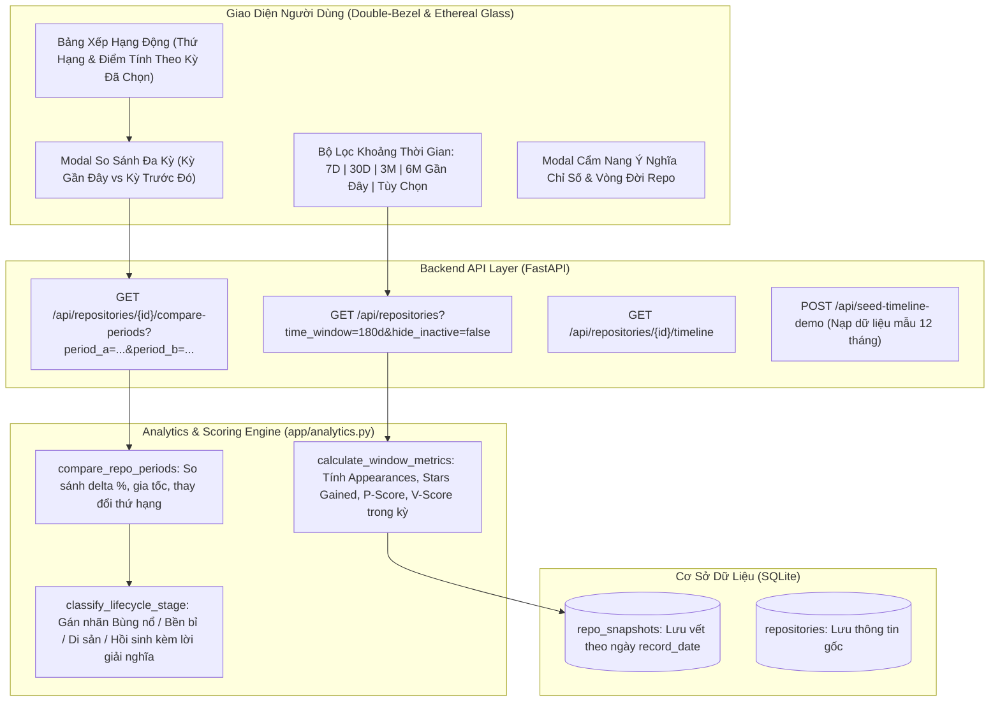

# Kế Hoạch Triển Khai: Trending Theo Khoảng Thời Gian & Phân Tích Trạng Thái Repo Đa Thời Điểm

## Bối Cảnh & Vấn Đề Cần Giải Quyết

1. **Vấn đề repo nổi tiếng từ lâu chiếm top:** Nếu tính tích lũy all-time, các repo kinh điển đã có hàng trăm nghìn stars hoặc xuất hiện nhiều lần trong quá khứ sẽ luôn đứng đầu bảng xếp hạng, che khuất những dự án đang thực sự bùng nổ trong thời gian gần đây.
2. **Nhu cầu phân tích theo mốc thời gian (Time-Window & Time-Travel):** Cần cho phép người dùng xem bảng trending trong một khoảng thời gian nhất định (ví dụ: 7 ngày qua, 30 ngày qua, 3 tháng qua, 6 tháng gần đây, hoặc khoảng thời gian tùy chọn). Khi đó, các chỉ số và thứ hạng chỉ tính trong khung thời gian đó.
3. **So sánh trạng thái repo qua các thời kỳ (Period-over-Period):** Cho phép xem trạng thái của một repo cụ thể ở các thời điểm khác nhau (ví dụ: 6 tháng gần đây vs 6 tháng trước đó / 6 tháng cùng kỳ năm trước).
4. **Giải nghĩa các chỉ số (Metric Insights & Lifecycle Interpretation):** Làm rõ ý nghĩa của các chỉ số (Persistence, Velocity, Stars Gained, Appearances) trong từng thời kỳ, phân loại repo vào các giai đoạn vòng đời: **Bùng nổ (Viral Breakout)**, **Trụ cột bền bỉ (Sustained Anchor)**, **Di sản / Hạ nhiệt (Legacy Saturated)**, **Hồi sinh (Revival)**, hoặc **Mầm non (Emerging)**.

---

## Đề Xuất Thiết Kế Kiến Trúc & Giải Pháp



---

## Chi Tiết Các Thay Đổi Cụ Thể

### 1. Module Phân Tích & Giải Nghĩa (`app/analytics.py` - [NEW])
Xây dựng module chuyên biệt xử lý dữ liệu theo chu kỳ thời gian:
- **`calculate_window_metrics(repo, snapshots, start_date, end_date)`:**
  - Lọc snapshots trong khoảng `[start_date, end_date]`.
  - Tính `window_appearances` (Daily, Weekly, Monthly).
  - Tính `window_stars_gained` (Chênh lệch giữa snapshot đầu và cuối trong kỳ, hoặc tổng `period_stars_count`).
  - Tính `window_persistence_score` và `window_velocity_score` tương ứng với chu kỳ đó.
  - Tính `window_trending_score = 0.5 * Velocity + 0.3 * Persistence + 0.2 * AppearanceFactor`.
- **`compare_repo_periods(repo, snapshots, p1_start, p1_end, p2_start, p2_end)`:**
  - So sánh chi tiết Kỳ 1 (ví dụ 6 tháng gần đây) với Kỳ 2 (ví dụ 6 tháng trước đó hoặc cùng kỳ năm trước).
  - Tính độ lệch $\Delta$ và tỷ lệ % tăng trưởng về Stars, Số ngày lọt top, Thứ hạng trung bình.
- **`classify_lifecycle_stage(metrics_curr, metrics_prev=None)`:**
  - Tự động gán nhãn trạng thái và sinh giải nghĩa chi tiết:
    - 🚀 **Bùng nổ (Viral Surge):** Velocity $\ge 70$, Stars gained cao vượt trội $\rightarrow$ *Ý nghĩa: Đang là tâm điểm chú ý của cộng đồng, thu hút lượng lớn nhà phát triển mới.*
    - 🛡️ **Trụ cột Bền bỉ (Sustained Anchor):** Persistence $\ge 65$, xuất hiện đều qua nhiều tuần/tháng $\rightarrow$ *Ý nghĩa: Thư viện/nền tảng cốt lõi được đưa vào sản xuất lâu dài.*
    - 💤 **Di sản / Hạ nhiệt (Legacy Saturated):** Tổng stars all-time rất lớn ($>30\text{k}$) nhưng số lần trending trong 6 tháng gần đây $\le 1$, Velocity thấp $\rightarrow$ *Ý nghĩa: Dự án kinh điển đã bão hòa thị phần, ít còn tính đột phá mới.*
    - 🔄 **Hồi sinh (Revival):** Kỳ trước trầm lắng nhưng kỳ này bứt phá tăng trưởng $>50\%$ $\rightarrow$ *Ý nghĩa: Ra mắt phiên bản lớn hoặc bắt nhịp xu hướng công nghệ mới (như AI/LLM).*
    - 🌱 **Mầm non (Emerging Prospect):** Repo mới xuất hiện lần đầu trong kỳ với tốc độ tốt $\rightarrow$ *Ý nghĩa: Dự án tiềm năng cần đưa vào danh sách theo dõi.*

### 2. Mở Rộng API Endpoints (`app/api.py`, `app/schemas.py` - [MODIFY])
- **`GET /api/repositories`**: Bổ sung query params:
  - `time_window`: `all`, `7d`, `30d`, `90d`, `180d` (6 tháng), `365d` (1 năm), `custom`.
  - `start_date`, `end_date` (dành cho `custom`).
  - `hide_inactive`: boolean (nếu `true`, ẩn repo có 0 lần xuất hiện trong kỳ đó).
  - Bổ sung các cột sắp xếp mới: `window_trending_score`, `window_appearances`, `window_stars_gained`.
- **`GET /api/repositories/{repo_id}/compare`**:
  - So sánh trực tiếp 2 khoảng thời gian của 1 repo.
  - Hỗ trợ các preset tiện lợi: `preset="6m_vs_prior_6m"` (6 tháng gần đây vs 6 tháng trước), `preset="6m_vs_same_last_year"` (6 tháng gần đây vs 6 tháng cùng kỳ năm ngoái), hoặc tùy chọn ngày.
  - Trả về bảng số liệu chi tiết, độ lệch $\Delta$, giai đoạn vòng đời và đoạn phân tích giải nghĩa (AI-style narrative).
- **`POST /api/seed-timeline-demo`**:
  - Tạo bộ dữ liệu mô phỏng 12 tháng qua với 4 nhóm repo tiêu biểu (Repo di sản nổi tiếng đã hạ nhiệt, Repo bùng nổ 6 tháng gần đây, Repo trụ cột ổn định, Repo mầm non) để người dùng bấm vào là trải nghiệm được ngay trên UI.

### 3. Giao Diện Người Dùng Cao Cấp (`app/templates/index.html` - [MODIFY])
Tuân thủ tuyệt đối các nguyên tắc từ `docs/SKILL.md` (Double-bezel, Ethereal glass, concentric radii, micro-interactions):
- **Thanh Chọn Khoảng Thời Gian (Time Window Segmented Pill Bar):**
  - Tích hợp phía trên bảng: `[Tất Cả] [7 Ngày] [30 Ngày] [3 Tháng] [6 Tháng Gần Đây] [1 Năm] [Tùy Chọn 📅]`.
  - Hiển thị badge trạng thái khoảng thời gian đang lọc (ví dụ: `Đang lọc: 2026-03-20 → 2026-09-20 (180 ngày)`).
  - Tùy chọn checkbox: *"Chỉ hiện repo có hoạt động trong kỳ"*.
- **Cập Nhật Cột Bảng Thống Kê Trong Kỳ:**
  - Khi chọn khoảng thời gian, bảng tự động hiển thị:
    - **Thứ hạng trong kỳ** (Dynamic Rank)
    - **Trending trong kỳ** (Số lần xuất hiện trong 6 tháng)
    - **⭐ Tăng Trong Kỳ** (Lượng star thực tế đạt được trong 6 tháng)
    - **Trending Score & Trạng Thái Vòng Đời** (Badge kèm icon: 🚀 Bùng nổ / 🛡️ Bền bỉ / 💤 Di sản / 🌱 Mầm non)
- **Modal "Phân Tích Đa Kỳ & So Sánh Vòng Đời (Time-Travel Comparison)":**
  - Bấm nút icon **📊 So Sánh Kỳ** ở mỗi repo hoặc trong chi tiết repo.
  - Trực quan hóa 2 cột: **Kỳ Gần Đây (6 Tháng)** vs **Kỳ Trước Đó (6 Tháng)**.
  - Bảng đối chiếu chỉ số: Số ngày trending, Stars tăng thêm, Persistence, Velocity kèm chỉ số biến động $\Delta$ (+X% / -Y%).
  - Thẻ **"Ý Nghĩa Chỉ Số & Đánh Giá Vòng Đời"**: Trình bày rõ ràng lý do repo đạt điểm như vậy và ý nghĩa thực tế của nó đối với cộng đồng công nghệ.
- **Modal / Card "Cẩm Nang Ý Nghĩa Chỉ Số":**
  - Giúp người dùng hiểu thấu đáo: Tại sao repo 100k stars lại có điểm trending thấp trong 6 tháng? Velocity đo lường điều gì? Persistence thể hiện điều gì?

### 4. Kiểm Thử Tự Động (`tests/test_analytics.py` - [NEW])
- Kiểm tra tính toán chính xác chỉ số trong cửa sổ thời gian (`calculate_window_metrics`).
- Kiểm tra loại trừ hoặc hạ thứ hạng của repo cũ không có snapshot trong kỳ.
- Kiểm tra thuật toán so sánh 2 kỳ (`compare_repo_periods`) và tính toán tỷ lệ tăng trưởng.
- Kiểm tra phân loại vòng đời (`classify_lifecycle_stage`) cho từng tình huống (Bùng nổ, Di sản, Bền bỉ).

---

## Kế Hoạch Xác Minh (Verification Plan)

### Automated Tests
```bash
PYTHONPATH=. .venv/bin/pytest -v tests/
```
Đảm bảo tất cả 8 test cũ và các test mới của `tests/test_analytics.py` đều PASSED.

### Manual Verification
1. Chạy ứng dụng `./run.sh` và mở trình duyệt tại `http://127.0.0.1:8000`.
2. Bấm nút **"Nạp Demo Đa Kỳ (12 Tháng)"** để nạp dữ liệu mô phỏng gồm các repo di sản nổi tiếng (stars cao nhưng 6 tháng gần đây không active) và repo bùng nổ gần đây.
3. Chuyển đổi giữa **"Tất Cả Thời Gian"** và **"6 Tháng Gần Đây"**:
   - Ở "Tất Cả Thời Gian": Các repo stars lớn all-time hiển thị theo tổng tích lũy.
   - Ở "6 Tháng Gần Đây": Các repo di sản bị đẩy xuống; các repo mới bùng nổ vươn lên dẫn đầu bảng xếp hạng.
4. Mở modal **"Phân Tích Đa Kỳ"** của một repo để kiểm tra tính năng so sánh 6 tháng gần đây vs 6 tháng trước đó và đọc giải nghĩa vòng đời.
5. Kiểm tra tính tương thích responsive trên mobile và desktop.
